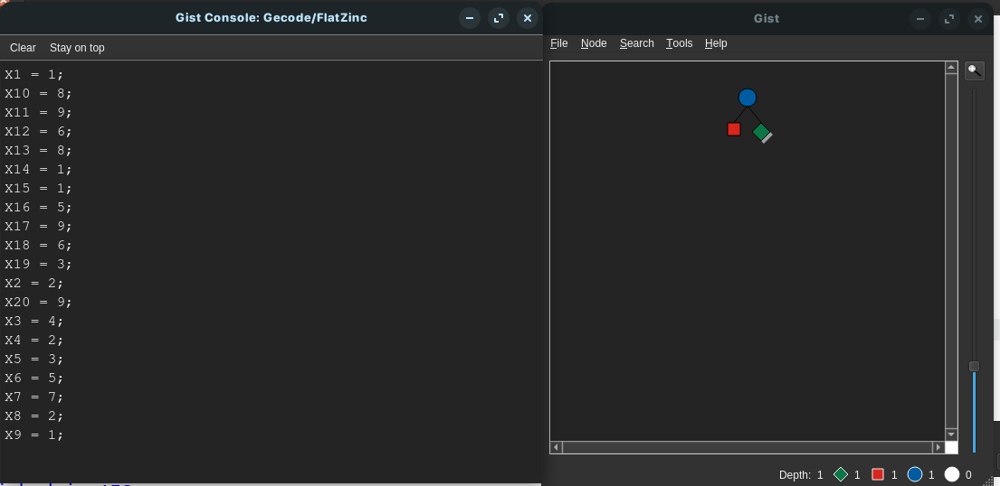

# Modelado del Kakuro como un Problema de Satisfacción de Restricciones (CSP)

## 1. Definición del Modelo CSP

### 1.1. Variables del Problema
En el Kakuro, las celdas blancas que deben llenarse representan variables. En este modelo, cada variable se denota como $X_i$ para $i = 1, 2, \ldots, n$, donde $n$ es el número total de celdas a completar.  
**Ejemplo:** En nuestro modelo, $n = 20$, definiéndose 20 variables: $X_1, X_2, \ldots, X_{20}$.

### 1.2. Dominios
Cada variable $X_i$ puede tomar valores del conjunto:  

$D(X_i) = \{1, 2, 3, 4, 5, 6, 7, 8, 9\}$

Esto se debe a que en Kakuro se utilizan dígitos entre 1 y 9.

### 1.3. Restricciones
Las restricciones en Kakuro se basan en dos aspectos fundamentales:

1. **Restricciones de Suma y Unicidad:**  
   Cada segmento (horizontal o vertical) posee una suma objetivo. Además, los dígitos dentro de un segmento deben ser todos distintos.  
   Por ejemplo, para un segmento de dos celdas:
$X_1 + X_2 = 3 \quad \text{y} \quad \text{alldifferent}(X_1, X_2)$

2. **Agrupación de Restricciones mediante el Predicado `word`:**  
   Se define el predicado `word` para asegurar que:
   - Los dígitos sean diferentes: `alldifferent(y)`.
   - La suma de los dígitos sea igual a la suma objetivo: \(s = \text{sum}(y)\).

De esta manera, cada segmento (horizontal o vertical) se modela mediante el predicado `word`.

---

## 2. Implementación en MiniZinc

### 2.1. Código del Modelo (`kakuro.mzn`)
```minizinc
% Modelo Kakuro en MiniZinc

include "globals.mzn";

int: n = 20;
set of int: R = 1..9;

% Variables de decisión: cada X_i representa un dígito entre 1 y 9.
var R: X1;
var R: X2;
var R: X3;
var R: X4;
var R: X5;
var R: X6;
var R: X7;
var R: X8;
var R: X9;
var R: X10;
var R: X11;
var R: X12;
var R: X13;
var R: X14;
var R: X15;
var R: X16;
var R: X17;
var R: X18;
var R: X19;
var R: X20;

array[1..n] of var R: X = [X1,X2,X3,X4,X5,X6,X7,X8,X9,X10,
                             X11,X12,X13,X14,X15,X16,X17,X18,X19,X20];

solve satisfy;

% Predicado "word":
% Verifica que los dígitos sean distintos y que la suma de éstos sea igual a la suma objetivo.
predicate word(array[int] of var int: y, var int: s) =
    alldifferent(y) /\
    s = sum(y)
;

% Restricciones del Kakuro:
constraint
    % Segmentos horizontales:
    word([X1, X2], 3) /\
    word([X3, X4], 6) /\
    word([X5, X6, X7, X8, X9], 18) /\
    word([X10, X11, X12], 23) /\
    word([X13, X14], 9) /\
    word([X15, X16], 6) /\
    word([X17, X18], 15) /\
    word([X19, X20], 12) /\
    
    % Segmentos verticales:
    word([X1, X5], 4) /\
    word([X13, X17], 17) /\
    word([X2, X6, X10, X14, X18], 22) /\
    word([X7, X11], 16) /\
    word([X3, X8, X12, X15, X19], 16) /\
    word([X4, X9], 3) /\
    word([X16, X20], 14)
;

% Salida formateada como una matriz (4 filas x 5 columnas)
output [
  concat([ if j = 1 then "\n" else " " endif ++ show( X[(i-1)*5 + j] )
          | j in 1..5 ])
  | i in 1..4
];
```

## Ejecución:


